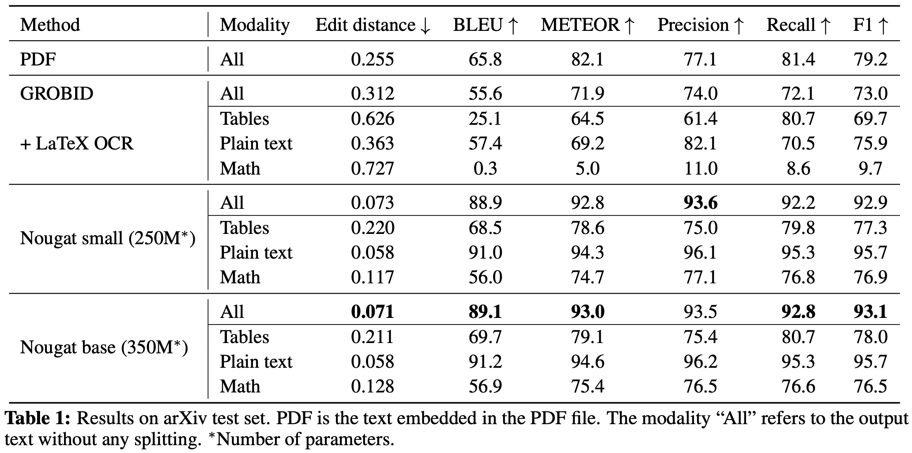

# Design Multimodal AI for PDF documents

Text-based AI system for pdf documents exists, but a multimodal AI system for pdf documents are yet to fully evolve!

## What we need:

## What we currently have:

- This article uniquely offers insights into multimodal model and multimodal data for document related real-world tasks, from an application and research perspective. 
- Each of the step below deserves an article on its own, but lets paint a full picture first, and then in future articles we can dive deep into each one them. 
- Now let's get started!

## General steps to build Multimodal AI for documents:

1. Multimodal model for documents
2. Multimodal pre-training data
3. Multimodal finetuning data 
4. Pretraining: pretraining task
5. Finetuning: Finetuning tasks. (Aligning model for specific tasks)
6. Instruction tuning (Aligning model for chat interface)
7. Tuning model for it to use external tools (Internet, image-generation, calculators, custom-tasks and etc)
8. Building a chat interface.

### What is AI system for documents?

- Documents, specifically lets take an example of pdfs, are a collection of structured text, tables, figures, plots, graphs and diagrams. 
- We want a system which can explain us/user these contents in a pdf document. 
- We want to be able to ask questions about the document, and the system should be able to generate answers based on the content of the document. 
- We can say, we want a AI-system/chat-bot where we want to upload our documents and ask questions about it, and the system/chat-bot generates answers based on the documents (uploaded documents), internal learnt knowledge (trained content) and external knowledge (augmented tools).

### You may ask, isn't ChatGPT already capable of doing it?

- Not completely yet (Jan-2024) !. Like other AI-systems for documents, it primarily relies on the text content present in the document.
- It will generate great answers for text content, good answers for tables and suboptimal answers for images (charts/plots/diagrams) in the pdf document. 
- You might have to crop image manually from document and upload for getting better answers on document images. 
- Also, not all pdfs are digitally-born or native-pdfs. Scanned pages containing text and images also exists in pdf formats. 
- OCR (Optical Character Recognition) task becomes crucial with these scanned pdfs. 
- The OCR capabilities of ChatGPT are not as advanced as those of specialized OCR models. 
- Here is the [link to paper](https://arxiv.org/abs/2310.16809) which studied OCR capabilities of ChatGPT (GPT-4V).

**Now, let's first understand the problems with current systems/models. We can address those challenges and build a better system.**

## Problems with current AI document processing models/systems

### Problem 1: Lack of well-perfoming end-to-end multimodal model which can comprehend all the components of a pdf or document.

- Components of a pdf/document are text, tables, charts, plots, diagrams and layout. 
- There is a lack of models which can perform well on ALL the components of a pdf or document. 
- There are tons of models addressing parts of it. Different models exist for addressing text-table data pairs, text-chart, text-plot, text-diagrams and layout detection. 
- But few to none which can handle all (text-tables-charts-plots-diagrams-layout).
- You may say, isn't charts, plots, diagrams are all images? and if a model is able to understand images, shouldn't it be able to comprehend all types of images?
- Answer is, ideally it should. But most of the widely used pretrained models are trained on natural images and not necessarily on document-type images.
- Natural images are the real-world object images. Like images of dogs, cats, trees and etc.
- Below example figures 1 and 2, shows the difference between natural-images and document-type images.

- **Plot/charts like pie-chart, bar-graphs and others, have text and visual elements in it with a particular 2D layout/structure. The diversity of these 2D layout/structures is enormous.** 
- Hence it has been a challenging task to build a well-performing model for document-type images.
- Many  works like MatCha, DePlot, DONUT, LayoutLMv3, UniChart and UReader have tried addressing this issue by training models on large corpus of document-type images and are also open-source. 
- These models perform well when presented with two modalities at a time, like text-table/text-diagram/text-chart/text-plot. 
- But, performance degrades when presented with text-table-chart/plot/diagram at once. Overview of these SOTA models is added at the end of the article.

### Problem 2: Cannot capture multipage multimodal context

- Text-based systems can handle context-text from multiple pages. But a document can have charts/plots, tables and text on one page or multiple pages. To properly encode charts/plots and tables, large number of tokens are required.

#### Why does encoding tables and plots/charts require large number of tokens?

- Table is a structured-text. To encode table with its 2D layout, special tokens are required to capture the layout. 
- Also, for chart/plots, a high-resolution chart/plot image is required. Why high resolution? can't a simple 224x224 size suffice?. No, there are numbers, characters and symbols on the chart/plot, which are lost if the image is captured in low-resolution.

- Most of the models described in previous section, can handle only one document-type image and one table as input along with textual input. But for a comprehensive answers, the model should be able to access multiple pages, to capture full context.

#### Why giving multiple pages is problem?

- Computations! In transformers, computations are quadratically related to input context length!. So increasing number of input pages is prohibitive in compute sensitive environment. 
- There have been works linearizing this relation, but the computations are still enormous for large context. 
- Hi-VT5 model is able to handle multiple document page images, but it uses OCR tokens along with the input page images. Including both OCR tokens and page-images tokens increases size of token length by a large amount which we want to avoid, and also OCR errors propogates and degrades the overall performance of the system.
- Hence, there is a need to reduce computations further. In next section shows state-of-the-art multimodal model architectures, which can give us potential insights into addressing this issue.

## Let's look at possible solutions! and build a system!

Let's follow the steps listed at the start of the article, understand its importance and build a better system.

#### Desired multimodal AI system for documents:

### Step 1: A suitable multimodal model architecture

- Why is this the first step?
- This will help us address the above two problems (not completely, but to some extent). The type of training data will further help, but first need to fix a model architecture.
- We want to capture the content and 2D structure in tables, plots, charts and diagrams. Vision-models are designed to capture such diverse 2D content and structure in images.
#### So, instead of text-input, vision-models can be used to capture this 2D content and structure by PRIMARILY  using document-page-image as our input.**
- This means we want to convert each document page to an image and provide the entire page as an image to the model. And, no text input to the model except the question from the user.
- This will help us avoid OCR, special tokens and textual tokens. So instead of giving text tokens, table tokens, and chart/plot/diagram image tokens separately to capture multimodal context, we can now give a document-page-image which contains all this information. 
- This doesn't necessarily decrease the number of tokens or computations? or can it?
#### If we study the transformer literature, we observe that, the vision-encoders are 4x to 10x smaller than LLMs. So, vision-encoders can be used to encode images with less computations when compared to directly giving image to LLM (or decoder. LLMs have decoder-only transformer architecture).
- Ok, so let's use encoder. But there are different multimodal model architecture types to choose from. Let's briefly understand them and choose based on our requirements.
- **Lot's of new ideas can be generated once we understand these below four multimodal model architecture types**

#### Four types of SOTA multimodal model architectures:

1. Standard encoder-decoder transformer

2. Vision-encoder + adapter + LLM (decoder)

3. Vision-encoder + projector + LLM (decoder)

4. Decoder-only (LLMs, GPT models)

- Architecture 2, 3 and 4 can leverage the SOTA LLM models by replacing its decoder with the best performing LLM. This is possible because, most of the LLMs are of decoder-only transformer architecture. So they can replace any decoder in encoder-decoder architectures except type 1.
- **The architecture type 2 and 3 suits our application.**
- The 2 and 3 tries to utilize latest best performing LLMs (decoders) and intergrates with best-performing vision-encoders. 
- Integration happens through a projector (one or multiple fully connected layers) or adapter (light-weight cross-attention with learnable embeddings). Future articles will be explaining these architectures in details
- Why LLMs cannot replace the decoder in type 1 architecture?. Critical difference between 1 and rest of the architecture is, the cross attention layer in decoder of the type 1 architecture. LLMs typically are not trained with cross attention layer. The type 1 architectures utilizes cross attention to process language and image tokens. It is pretrained and finetuned with cross attention present in the architecture.

### Step 2: Multimodal Pretraining data

- The Multimodal documet AI system should generate answer from the uploded documents, but the document doesn't contain all the knowledge to generate a comprehensive answer. It needs background knowlege. 
- For example, in research papers (one type of document), the authors might refer an abbreviation, whose full definition might be present in some other papers or wikipedia.
- We want this background knowledge in our model to be of multimodal in nature. Text-based general knowledge model exists. But a multimodal model, trained on large-scale open-source multimodal data doesn't exists yet or is not open-source yet. So need to first pretrain our multimodal model with general-multimodal-knowledge. 
- Large scale multimodal data suitable for document related tasks is not available. 
- **We need paired-data, i.e, text-table-chart/plot/figure/diagrams should be present in one data sample, for the model to learn the correlation between these three document modalities.**
- There are large scale datasets with text-table, text-chart, text-plot, but no large scale dataset which has text-table-chart/plot/figure/diagram in each data sample. Hence, we need to find new ways.
- **Two possible sources: Wikipedia webpages as a pdf, and pdf of Arxiv papers.**
- A Wikipedia webpage can be converted to a pdf. This pdf will have multiple pages. These webpages has multimodal data in them. So a multimodal multipage dataset can be created.
- **Wikipedia can be a best source of multimodal knowledge. It consists of broad topics, has text, images and tables. Which is suitable for documents.**
- The layout is not diverse, but the knowledge and multimodality of it is useful due to its scale.
- **Arxiv paper are great source of paired-data of text-table-chart-plots-diagrams. Also they come in various layouts. Hence, this is a great source for multimodal pretraining data for document tasks.**

### Step 3: Multimodal Finetuning Data

- Document related tasks: OCR, layout-detection, summarization, key-information extraction, Question-and-Answering. Lots of datasets are available for each of these tasks. DocVQA, InfoVQA, ChartQA, TextVQA, DeepForm, FUNSD, CORD, RVL-CDIP.
- New or advanced way of generating finetuning data: LLaVA paper shows excellent ways to generate finetuning data by leveraging GPT-4. A small dataset with small real-world data can be converted to a larger dataset using GPT-4.
- In multimodal domain, data generation through automation is key to fast development, because there is a lack of large real world multimodal data right now.

### Step 4: Pretraining: Pretraining task

- Typically used pretraining tasks are desgined such that the model is able to read text in the image in order to solve the complex tasks during finetuning. 
- If no OCR inputs are used, OCR task is used as pretraining task. 
- If OCR inputs are used, then Multimodal-masked-language-modeling is used.

### Step 5: Finetuning: finetuning task

- Document related finetuning tasks: Layout-detection, summarization, key-information extraction, Question-and-Answering. 
- Use datasets listed in the multimodal-finetuning-data section to train on these tasks.

### Step 6: Instruction tuning (Aligning model for chat interface)

- Why is this required?

    - **Reason 1**: 
        - Users need structured and natural language answers. Finetuned models may not necessarily generate structured natural language answers. 
        - Example, model output for layout detection, may simply be coordinate numbers. But user might not understand it clearly. The coordinates must accompany with a text explaining the details in brief. 
        - In order to achieve this, we need to train the model further to generate responses which are structured and look natural to the user. This training process is aligning the model for chat.

    - **Reason 2**: 
        - Also, to answer complex reasoning questions, the model may not be able to generate answer in one interaction. 
        - The instruction tuning process, trains/prompts the model to break the question into multiple parts and allows the models to iteratively answer the individual parts of the question, so that an comprehensive answer is generated at the end. 
        - [ReAct](https://arxiv.org/abs/2210.03629) framework is used to achieve this.

- This step can also be used to train/prompt the model to use external tools, but it is best practise to separate these two phases. 
- Why? We first want model to generate responses based on its internal (wikipedia, arxiv) and the document knowledge, so that we can understand limitations of the model for further improvement.
- How to do this?: 
    - Generate data with ReAct format such that complex tasks or questions are broken down into small steps and model generate responses for each of the small step. Generate data manually or find automated process leveraging GPT-3.4 or GPT-4.

### Step 7: Tuning model for it to use external tool use (Internet, image-generation, calculators, custom-tasks and etc)
- Why do we need this?
    - When the model is not able to generate confident response from its internal knowledge or the document, it should be able to access external knowledge and tools to generate better response. These tools, can be accessing internet, calculator, custom task and etc.
    - This stage also uses REACT framework. But here the training will be explicitly for training the model to use the augmented tools.
- How to do this?
    - Generate training data with ReAct format. The responses in each data sample should include request or keywords for indicating external tool use. Generate data manually or find automated process leveraging GPT-3.4 or GPT-4.

### Step 8: Building a chat interface.
- Streamlit and gradio allows us to quickly build chat interfaces for our LLMs and multimodal models.
- **The multimodal model we develop will always have a input-page-limit. For example 10 or 20 page-images can be given to the model at once. Then what happens when there is a document with more pages than that?**
- Vector database comes to rescue! It allows us to store and retrieve large number of document pages. For example, if we had to perform Q&A on 300 page book, then first we encode each page and store it in vector database. Once user asks a question, based on the question relevance, 10 or 20 pages from the vector database is extracted. These 10 or 20 pages are now sent to our multimodal model for document processing and generating answer.

- There is a new wave of multimodal RAG system development for deploying multimodal chat-bots using LangChain, LLamaIndex and others.

- **This article mainly focused on the multimodal model development which includes training and data details. There are lot of resources online to learn how to build a chat interfaces with vector databases and other frameworks.**

## Overview of SOTA document processing models:

We can categorize SOTA models based on its capability of how many document pages it can handle at once. Two main categories emerge, Multi-page DocVQA models and Single-page DocVQA models. Also, each of this category can be divided further into subcategories based on OCR utilization like OCR-based models and OCR-free models. Let's list these models into their categories and later look at details of few important models.

### Categorizing SOTA models

- Multi-page DocVQA:
    - OCR-based Multi-page DocVQA:
        - Hi-VT5, LATIN-prompt
    - OCR-free Multi-page DocVQA:
        - This type of models are what we ideally need to build best performing Multimodal Document AI. To best of my knowledge, currently there is only one work, PDFTriage. But this is ONLY for native PDF documents, hence is not general to work with different type of documents. The model architecture, data and training processes described at the start of the article can be used to build an OCR-free Multi-page DocVQA  models.
- Single-page DocVQA:
    - OCR-based Single-page DocVQA models:
        - LayoutLMv3, LayoutLMv2, LayoutLMv1, GeoLayoutLM, DocFormer, XYLayoutLM, ViBERTgrid, Bi-VLDoc and LiLT.
    - OCR-free Single-page DocVQA models:
        - Kosmos-2.5, StrucText-V2, DONUT, LLaVAR, UniDoc, UReader, mPLUG-DocOwl, PixT3.
    - Single-page DocVQA models for High resolution images
        - Nougat and DocPedia.\

Lets dive into few important models listed above.

### Nougat:
- Nougat (Neural Optical Understanding for Academic Documents), is a multimodal transformer model. 
- This model is primarily build to handle PDF type documents. Specifically  for OCR task on academic documents. It is great for text and table extraction from the document images. 
- The input is an image of a page in PDF. That means, each pdf page is converted to an image of size 896x762 (HxW) and this image is provided as an input to the model. The output lightweight markup language [markdown file (.md file)]. 
- The model architecture is of encoder-decoder type transformer. The encoder is a swin-transformer and decoder is mBART. 
- It is trained for OCR task on datasets like arXiv, PubMed Central (PMC) and Industrial documents library (IDL). Total of ~1.7M PDFs from arXiv were used for training. 
- Below image shows the NOUGAT model architecture and results of OCR task on arXiv test data from the published research paper.

### UReader:
- UReader is a multimodal model for OCR-free vision-language tasks. 
- It shows that, with low-cost instruction tuning, SOTA performance can be achieved on various vision-language tasks. No pretraining step is performed for this model. 
- All the tasks are converted into vision-language instruction tuning format before training. 
- It also introduces text reading and key points generation task during finetuning for enhancing text reading and semantic understanding across different tasks. 
- For processing high-resolution images, it introduces adaptive image cropping module to crop high resolution images into smaller ones. These smaller images are then encoded using frozen image encoder and learnable visual abstractor/projector layer. 
- This paper contributes 5 instruction-tuning datasets covering 5 domains of vision-language tasks. These 5 datasets include image of type document, table, chart, natural image, and webpage screenshot. 
- UReader model is built on top of mPLUG-owl model. mPLUG-owl model is a multimodal model, built using a modulerized learning technique, which enables combining pretrained LLM and pretrained encoders (image or other modalities) to create a multimodal model. 
- Below images show model architecture and results from the research paper.

### LayoutLMv3:
- LayoutLMv3 comes from a legacy of LayoutLM models from Microsoft. 
- The first LayoutLM model (LayoutLMv1) introduced pretraining techniques, first of its kind to jointly model text and layout in scanned documents during pretraining. 
- Later, LayoutLMv2 introduced new pretraining tasks to jointly model interactions between text, layout and image in a single Multimodal framework. 
- LayoutLMv3 proposes to jointly use Masked-Language-Modeling (MLM) and Masked-Image-Modeling (MIM) for pretraining. It demonstrated SOTA performance on both text-centric and image-centric tasks. 
- Below images show the model architecture and results comparing its performance to previous LayoutLM models and other works.

### UniChart:
- UniChart is a Universal Vision-language pretrained model for chart comprehension and reasoning. 
- This paper introduces a large-scale chart corpus containing a diverse range of visual styles and topics for pretraining.
- Chart specific pretraining tasks are proposed, which enables this model to achieve SOTA performance. These pretraining techinques include both low-level and high-level chart related tasks. 
- The low-level pretraining tasks allows model to be used for information extraction. 
- The high-level pretraining tasks helps model to acquire complex reasoning skills.  
- Below images show the model architecture and results.

